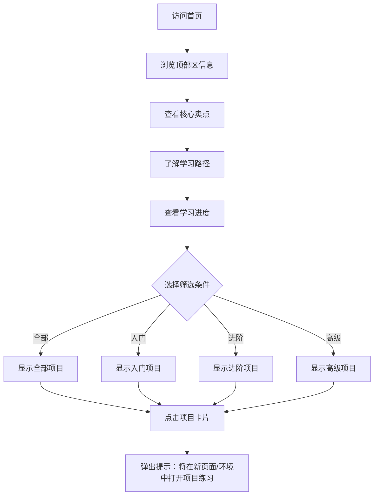

# Pandas 数据分析实战训练营 - 产品需求文档

## 1. 产品概述

Pandas 数据分析实战训练营是一个纯前端展示型学习网站，旨在为数据采集技术课程的学生提供交互式 Pandas 数据分析学习平台。网站模拟真实在线编程学习环境，让用户无需安装任何软件即可在浏览器中学习数据分析技能。

**目标用户**：广东科学技术职业学院商学院商务数据分析与应用专业学生
**核心价值**：零门槛掌握数据分析全栈技能，通过10个行业级实战项目循序渐进学习

---

## 2. 核心功能模块

### 2.1 页面结构

| 页面名称 | 模块名称 | 功能描述 |
|---------|---------|---------|
| 首页 | 顶部区 | 大标题、标语、角标、问候语 |
| 首页 | 卖点区块 | 4个核心卖点展示（图标+文字） |
| 首页 | 学习路径 | 5个阶段的学习路径展示 |
| 首页 | 进度看板 | 学习统计数据展示 |
| 首页 | 示例项目 | 突出展示"购物车分析"示例项目 |
| 首页 | 项目列表 | 10个实战项目卡片，支持筛选 |

### 2.2 功能详情

#### 顶部区
- 主题标语：「Pandas数据分析实战训练营」「10个行业级实战项目」「从数据清洗到机器学习」「零门槛掌握数据分析全栈技能」
- 角标：「全新升级·浏览器端即刻学习」
- 问候语：「大家好！我是来自广东科学技术职业学院商学院商务数据分析与应用的学生，欢迎使用！狸猫」

#### 三个核心卖点区块
- 真实商业数据集
- 实时代码运行
- 循序渐进路径
- 技能认证证书

#### 系统化学习路径（5个阶段）
1. 数据预处理 - 掌握数据清洗与转换
2. 统计分析 - 描述性统计与可视化
3. 关联与聚类 - 挖掘数据关联规律
4. 预测建模 - 机器学习入门
5. 综合实战 - 完整数据分析报告

#### 学习进度看板
- 完成项目：0 / 10
- 学习时长：0小时
- 连续天数：0天
- 获得徽章：0个

#### 10个项目列表
| 序号 | 难度 | 预估时长 | 项目名称 | 描述 | 数据集 |
|-----|------|---------|---------|------|-------|
| 1 | 入门 | 30分钟 | 零售订单数据清洗 | 缺失值处理、重复值删除 | retail_orders.csv |
| 2 | 入门 | 30分钟 | 电影评分分析 | 数据筛选、排序、统计 | movies_ratings.csv |
| 3 | 入门 | 30分钟 | 用户行为日志处理 | 字符串处理、时间转换 | user_behavior.csv |
| 4 | 进阶 | 45分钟 | 销售数据透视分析 | 数据透视表、分组聚合 | sales_data.csv |
| 5 | 进阶 | 45分钟 | 客户流失预警分析 | 特征工程、相关性分析 | churn_data.csv |
| 6 | 进阶 | 45分钟 | 库存周转分析 | 指标计算、数据可视化 | inventory.csv |
| 7 | 高级 | 60分钟 | 购物篮分析 | 关联规则挖掘 | market_basket.csv |
| 8 | 高级 | 60分钟 | 用户聚类分析 | K-Means聚类 | customer_features.csv |
| 9 | 高级 | 60分钟 | 销售预测建模 | 线性回归入门 | historical_sales.csv |
| 10 | 高级 | 60分钟 | 综合数据报告 | 完整数据分析流程 | multi_source.csv |

#### 项目分类与筛选
- 筛选按钮：全部、入门、进阶、高级
- 点击切换筛选项目卡片

#### 示例项目展示
- 突出展示：「购物车分析-在线零售业务数据分析报告」
- 包含"下载报告"按钮

---

## 3. 用户交互流程



---

## 4. 用户界面设计

### 4.1 设计风格
- **主题**：数据分析/编程学习场景
- **风格**：简洁、现代、专业
- **布局**：卡片式布局为主，良好留白
- **配色**：深色科技风为主，点缀亮色强调

### 4.2 色彩方案
- **主色**：#6366F1（靛蓝色 - 代表数据/技术）
- **辅助色**：#22D3EE（青色 - 活力/学习）
- **强调色**：#F59E0B（琥珀色 - 重要信息）
- **背景色**：#0F172A（深蓝黑）
- **卡片背景**：#1E293B（深灰蓝）
- **文字色**：#F8FAFC（近白色）、#94A3B8（次要文字）

### 4.3 字体选择
- **标题字体**：Noto Sans SC（思源黑体）- 700 weight
- **正文字体**：Noto Sans SC - 400 weight
- **代码字体**：JetBrains Mono（等宽）

### 4.4 组件样式
- **卡片**：圆角16px，微妙的box-shadow，hover时有轻微上浮效果
- **按钮**：圆角按钮，hover状态有颜色变化
- **标签**：小圆角胶囊形状
- **图标**：Lucide React图标库

### 4.5 动画效果
- 页面加载：卡片依次淡入（staggered animation）
- 悬停：卡片轻微上浮 + 阴影加深
- 筛选切换：项目卡片平滑过渡
- 弹窗：居中弹出，带背罩

---

## 5. 技术实现

### 5.1 技术栈
- React 18 + TypeScript
- Vite（构建工具）
- Tailwind CSS（样式）
- Zustand（状态管理）
- Lucide React（图标）

### 5.2 响应式设计
- Desktop-first设计
- 适配平板和移动端
- 断点：md（768px）、lg（1024px）

---

## 6. 项目文件结构

```
/workspace
├── .trae/
│   └── documents/
│       ├── PRD.md
│       └── TECHNICAL_ARCHITECTURE.md
├── src/
│   ├── components/
│   │   ├── Header.tsx
│   │   ├── HeroSection.tsx
│   │   ├── FeatureCards.tsx
│   │   ├── LearningPath.tsx
│   │   ├── ProgressDashboard.tsx
│   │   ├── FeaturedProject.tsx
│   │   ├── ProjectFilter.tsx
│   │   ├── ProjectCard.tsx
│   │   ├── ProjectList.tsx
│   │   └── ProjectModal.tsx
│   ├── pages/
│   │   └── HomePage.tsx
│   ├── data/
│   │   └── projects.ts
│   ├── store/
│   │   └── useStore.ts
│   ├── App.tsx
│   ├── main.tsx
│   └── index.css
├── index.html
├── package.json
├── tsconfig.json
├── vite.config.ts
└── tailwind.config.js
```
