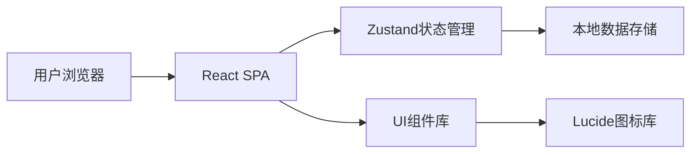
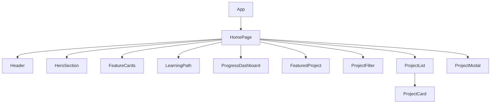

# Pandas 数据分析实战训练营 - 技术架构文档

## 1. 架构设计



**架构说明**：
- 纯前端单页应用（SPA）
- React + TypeScript 构建
- Zustand 管理筛选状态和进度数据
- 所有数据写死在代码中（mock data）

## 2. 技术选型

| 类别 | 技术 | 版本 |
|-----|------|-----|
| 框架 | React | 18.x |
| 语言 | TypeScript | 5.x |
| 构建工具 | Vite | 5.x |
| 样式 | Tailwind CSS | 3.x |
| 状态管理 | Zustand | 4.x |
| 图标 | Lucide React | 最新版 |
| 字体 | Google Fonts (Noto Sans SC, JetBrains Mono) | - |

## 3. 路由定义

| 路由 | 页面 | 说明 |
|-----|------|-----|
| / | HomePage | 首页，包含所有内容 |

由于是单页应用，所有内容在首页中通过组件切换展示。

## 4. 组件结构



### 4.1 组件职责

| 组件 | 文件 | 职责 |
|-----|------|-----|
| Header | Header.tsx | 顶部导航栏 |
| HeroSection | HeroSection.tsx | 主标题区域，包含角标和问候语 |
| FeatureCards | FeatureCards.tsx | 四个核心卖点展示 |
| LearningPath | LearningPath.tsx | 五阶段学习路径 |
| ProgressDashboard | ProgressDashboard.tsx | 学习进度统计看板 |
| FeaturedProject | FeaturedProject.tsx | 示例项目展示 |
| ProjectFilter | ProjectFilter.tsx | 难度筛选按钮组 |
| ProjectList | ProjectList.tsx | 项目卡片列表容器 |
| ProjectCard | ProjectCard.tsx | 单个项目卡片 |
| ProjectModal | ProjectModal.tsx | 项目点击弹窗 |

## 5. 数据模型

### 5.1 项目数据

```typescript
interface Project {
  id: number;           // 1-10
  name: string;         // 项目名称
  description: string;  // 简短描述
  difficulty: '入门' | '进阶' | '高级';
  duration: string;     // 如 '30分钟'
  dataset: string;      // 数据集文件名
  skills: string[];     // 涉及的技能
}
```

### 5.2 状态管理

```typescript
interface AppState {
  filter: '全部' | '入门' | '进阶' | '高级';
  selectedProject: Project | null;
  isModalOpen: boolean;
  // 进度数据（写死）
  completedProjects: number;
  learningHours: number;
  streakDays: number;
  badges: number;
}
```

## 6. 交互设计

### 6.1 筛选交互
1. 用户点击筛选按钮
2. 更新 Zustand store 中的 filter 状态
3. ProjectList 根据 filter 过滤显示项目

### 6.2 项目卡片点击
1. 用户点击项目卡片
2. 更新 selectedProject 和 isModalOpen 状态
3. ProjectModal 弹窗显示

### 6.3 弹窗关闭
1. 用户点击关闭按钮或遮罩
2. 重置 isModalOpen 为 false

## 7. 样式规范

### 7.1 CSS 变量
```css
:root {
  --color-primary: #6366F1;
  --color-secondary: #22D3EE;
  --color-accent: #F59E0B;
  --color-bg: #0F172A;
  --color-card: #1E293B;
  --color-text: #F8FAFC;
  --color-text-muted: #94A3B8;
}
```

### 7.2 Tailwind 配置
- 扩展主题颜色
- 添加自定义字体族
- 配置动画关键帧

## 8. 性能考虑

- 组件懒加载：不需要（所有内容在首页）
- 图片优化：使用 SVG 图标，无大图
- 代码分割：Vite 默认处理
